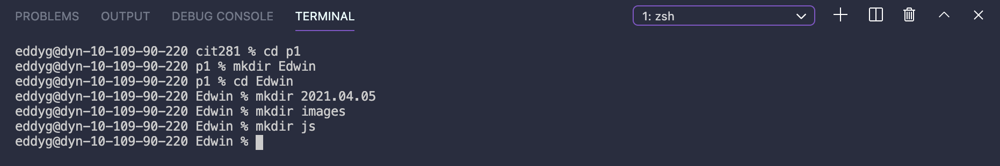
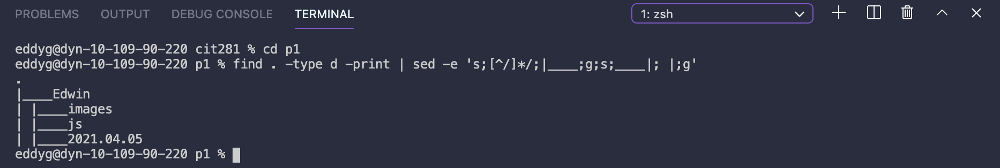
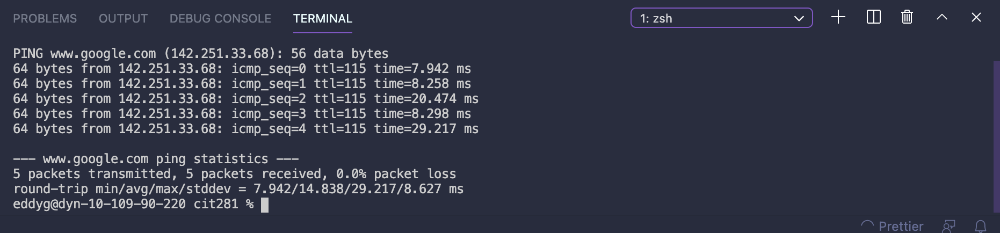
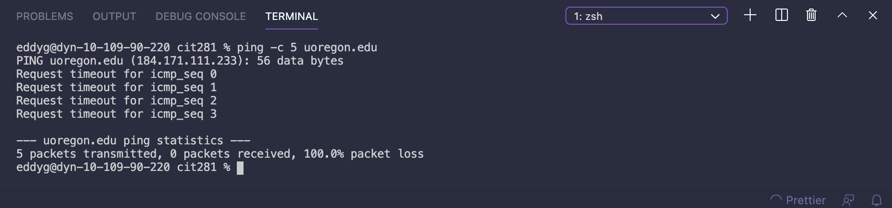

## File Overview:

- p1-date.js: A single line of code that will display the accurate day of the week into the console.
- p1-random.js: Generates a random string of letters (lower case) between 5 and 25 in length.
- CLI results of making folders, displaying the folders, setting up a ping command, and breaking the command:

 
 
